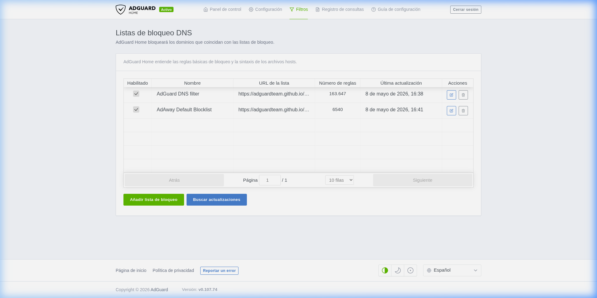
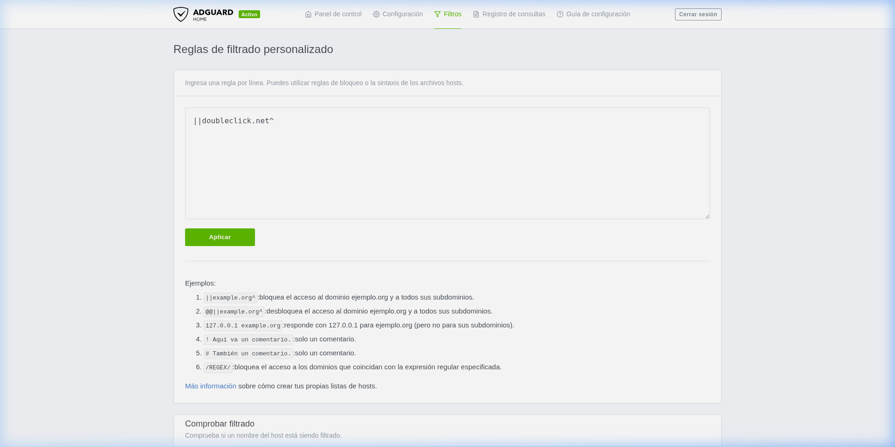
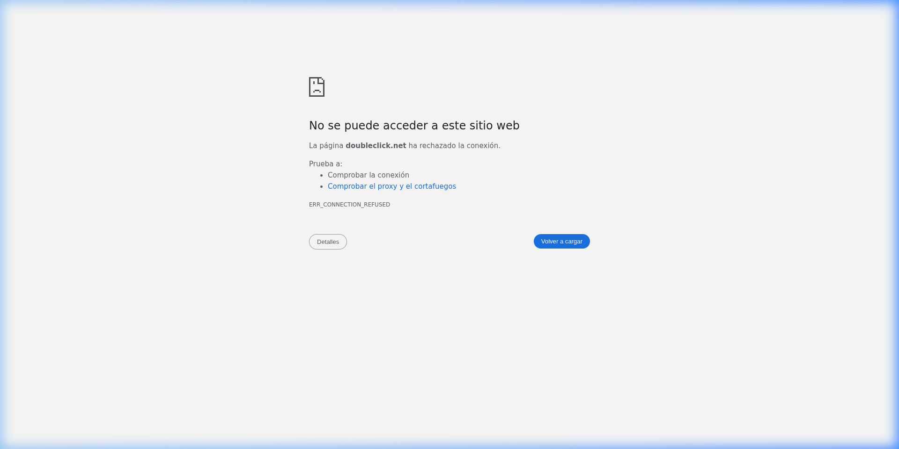

# Pràctica AdGuard Home — Bloc 4 · Tallafocs

**Mòdul:** 0378 Seguretat i alta disponibilitat  
**Centre:** Institut El Calamot  
**Curs:** 2025-2026  
**Alumne:** Izan Gómez Solano

---

## Índex

1. [Objectiu](#1-objectiu)
2. [Requisits previs](#2-requisits-previs)
3. [Desplegament amb Docker Compose](#3-desplegament-amb-docker-compose)
4. [Configuració inicial (Wizard)](#4-configuració-inicial-wizard)
5. [Activació de llistes de filtratge](#5-activació-de-llistes-de-filtratge)
6. [Regles de filtratge personalitzades](#6-regles-de-filtratge-personalitzades)
7. [Configuració DNS de l'equip](#7-configuració-dns-de-lequip)
8. [Demostració de bloqueig](#8-demostració-de-bloqueig)
9. [Panell de control i estadístiques](#9-panell-de-control-i-estadístiques)
10. [Explicació de decisions](#10-explicació-de-decisions)

---

## 1. Objectiu

Desplegar **AdGuard Home** com a servidor DNS local mitjançant Docker Compose, configurar-lo com a DNS principal de la màquina, activar llistes de filtratge per bloquejar dominis de publicitat i rastreig, i documentar tot el procés amb captures de pantalla.

---

## 2. Requisits previs

- Sistema operatiu: **Debian 13 (Trixie)**
- Docker Engine instal·lat i en funcionament
- Docker Compose v5.1.3
- L'usuari ha de pertànyer al grup `docker` per executar contenidors sense `sudo`

```bash
# Afegir l'usuari al grup docker (com a root)
/usr/sbin/usermod -aG docker alumnat
```

---

## 3. Desplegament amb Docker Compose

### Fitxer `docker-compose.yml`

```yaml
services:
  adguardhome:
    image: adguard/adguardhome
    container_name: adguardhome
    restart: unless-stopped
    ports:
      - "53:53/tcp"
      - "53:53/udp"
      - "3000:3000/tcp"
    volumes:
      - adguard_work:/opt/adguardhome/work
      - adguard_config:/opt/adguardhome/conf

volumes:
  adguard_work:
  adguard_config:
```

### Explicació dels paràmetres

| Paràmetre | Descripció |
|---|---|
| `image: adguard/adguardhome` | Imatge oficial d'AdGuard Home des de Docker Hub |
| `container_name: adguardhome` | Nom fix del contenidor per facilitar la gestió |
| `restart: unless-stopped` | El contenidor es reinicia automàticament excepte si es para manualment |
| `53:53/tcp` i `53:53/udp` | Port DNS estàndard, tant TCP com UDP |
| `3000:3000/tcp` | Port del panell d'administració web |
| `adguard_work` | Volum **nombrat i persistent** gestionat per Docker per a dades de treball |
| `adguard_config` | Volum **nombrat i persistent** gestionat per Docker per a la configuració |

### Execució

```bash
# Desplegar el servei
docker compose up -d

# Verificar que el contenidor està en marxa
docker ps --filter name=adguardhome
```

Resultat:

```
CONTAINER ID   IMAGE                 COMMAND                  CREATED         STATUS         PORTS
54419ddb0f7e   adguard/adguardhome   "/opt/adguardhome/Ad…"   6 seconds ago   Up 5 seconds   0.0.0.0:53->53/tcp, 0.0.0.0:53->53/udp, 0.0.0.0:3000->3000/tcp
```

---

## 4. Configuració inicial (Wizard)

Un cop el contenidor està en marxa, hem accedit a l'assistent de configuració inicial a `http://localhost:3000`.

### Passos de l'assistent:

1. **Interfície d'administració web**: Configurat a `0.0.0.0:3000` (totes les interfícies)
2. **Servidor DNS**: Configurat a `0.0.0.0:53` (totes les interfícies)
3. **Usuari administrador**: Creat l'usuari `admin` amb contrasenya segura
4. **Configuració de dispositius**: Informació sobre com apuntar els dispositius al DNS
5. **Finalització**: Redirecció al panell de control

---

## 5. Activació de llistes de filtratge

S'han activat **dues llistes de bloqueig DNS** des del menú *Filtros > Listas de bloqueo DNS*:

| Llista | Regles | Descripció |
|---|---|---|
| **AdGuard DNS filter** | 163.647 | Llista principal d'AdGuard amb dominis de publicitat, rastreig i malware |
| **AdAway Default Blocklist** | 6.540 | Llista comunitària popular enfocada en bloqueig de publicitat mòbil i web |

**Total de regles actives: 170.187 dominis bloquejats**



---

## 6. Regles de filtratge personalitzades

A més de les llistes predefinides, hem afegit una **regla de filtratge personalitzada** per demostrar el bloqueig explícit d'un domini específic.

Des de *Filtros > Reglas de filtrado personalizado* hem afegit:

```
||doubleclick.net^
```

Aquesta regla bloqueja el domini `doubleclick.net` (servei de publicitat de Google) i tots els seus subdominis.



---

## 7. Configuració DNS de l'equip

Hem configurat la connexió de xarxa de l'equip (`WIFI_MODS`) per utilitzar **exclusivament** AdGuard Home (`127.0.0.1`) com a servidor DNS:

```bash
# Configurar el DNS a 127.0.0.1 i ignorar els DNS automàtics del DHCP
nmcli con mod WIFI_MODS ipv4.dns '127.0.0.1' ipv4.ignore-auto-dns yes

# Reaplicar la connexió per activar els canvis
nmcli con up WIFI_MODS
```

### Verificació del fitxer `/etc/resolv.conf`:

```bash
$ cat /etc/resolv.conf
# Generated by NetworkManager
nameserver 127.0.0.1
```

Això confirma que **totes les peticions DNS del sistema** passen ara per AdGuard Home.

### Configuració DNS d'AdGuard Home

AdGuard Home està configurat per reenviar les consultes DNS legítimes al proveïdor **Quad9 (DNS over HTTPS)**:

- **Proveïdor DNS upstream**: `https://dns10.quad9.net/dns-query`
- **Servidors DNS d'arrencada**: `9.9.9.10`, `149.112.112.10`, `2620:fe::10`
- **Mode de bloqueig**: Predeterminat (resposta amb IP `0.0.0.0`)


---

## 8. Demostració de bloqueig

### 8.1 Prova amb `dig`

Hem executat una consulta DNS apuntant al nostre AdGuard Home per comprovar que el domini `doubleclick.net` queda bloquejat:

```bash
$ dig @127.0.0.1 doubleclick.net

; <<>> DiG 9.20.21-1~deb13u1-Debian <<>> @127.0.0.1 doubleclick.net
; (1 server found)
;; global options: +cmd
;; Got answer:
;; ->>HEADER<<- opcode: QUERY, status: NOERROR, id: 10485
;; flags: qr rd ra; QUERY: 1, ANSWER: 1, AUTHORITY: 0, ADDITIONAL: 0

;; QUESTION SECTION:
;doubleclick.net.		IN	A

;; ANSWER SECTION:
doubleclick.net.	10	IN	A	0.0.0.0

;; Query time: 0 msec
;; SERVER: 127.0.0.1#53(127.0.0.1) (UDP)
;; WHEN: Fri May 08 16:43:54 CEST 2026
;; MSG SIZE  rcvd: 49
```

**Resultat**: El domini `doubleclick.net` es resol a `0.0.0.0` (blackholed), demostrant que AdGuard Home bloqueja la petició DNS correctament.

### 8.2 Comparació amb un domini legítim

```bash
$ dig @127.0.0.1 google.com +short
142.251.142.142
```

El domini `google.com` es resol correctament a la seva IP real, confirmant que AdGuard Home només bloqueja els dominis inclosos a les llistes de filtratge.

### 8.3 Prova des del navegador

Al navegar directament a `http://doubleclick.net` des del navegador, obtenim un error **ERR_CONNECTION_REFUSED** perquè el domini es resol a `0.0.0.0`:



El navegador no pot establir connexió perquè AdGuard Home ha respost amb una IP nul·la, actuant de manera equivalent a una regla `DROP` en un tallafocs de xarxa tradicional.

---

## 9. Panell de control i estadístiques

El panell de control d'AdGuard Home proporciona visibilitat en temps real sobre l'activitat DNS:


### Estadístiques observades (últimes 24 hores):

| Mètrica | Valor |
|---|---|
| **Consultes DNS totals** | 216 |
| **Bloqueig per filtres** | 12 (5,56%) |
| **Malware/phishing bloquejat** | 0 |
| **Temps mitjà de processament** | 363 ms |
| **Client principal** | 172.19.0.1 (100% del tràfic) |

### Dominis més bloquejats:

| Domini | Peticions | Percentatge |
|---|---|---|
| `doubleclick.net` | 7 | 58,33% |
| `ads.mozilla.org` | 2 | 16,67% |
| `ogads-pa.clients6.google.com` | 2 | 16,67% |

### Dominis més consultats:

| Domini | Peticions | Percentatge |
|---|---|---|
| `antigravity-unleash.goog` | 36 | 16,67% |
| `detectportal.firefox.com` | 19 | 8,8% |
| `daily-cloudcode-pa.googleapis.com` | 15 | 6,94% |

---

## 10. Explicació de decisions

### Elecció de la tecnologia de desplegament

S'ha optat per **Docker Compose** per les següents raons:
- **Reproductibilitat**: Qualsevol persona pot replicar el desplegament amb un sol fitxer
- **Aïllament**: El servei funciona en un contenidor sense afectar el sistema amfitrió
- **Persistència selectiva**: Només es persisteixen els directoris necessaris (`/work` i `/conf`)
- **Facilitat de gestió**: `docker compose up -d` per aixecar, `docker compose down` per aturar

### Elecció de llistes de filtratge

| Llista | Justificació |
|---|---|
| **AdGuard DNS filter** | Llista més completa (163K regles) que cobreix publicitat, rastreig i dominis maliciosos. Mantinguda activament per l'equip d'AdGuard |
| **AdAway Default Blocklist** | Complement comunitari que afegeix 6.5K regles addicionals, especialment enfocades en publicitat mòbil. Molt popular i fiable |
| **Regla personalitzada `doubleclick.net`** | Demostració pràctica de com un administrador pot bloquejar dominis específics de forma manual, simulant una ACL de tallafocs |

### Configuració de xarxa

- **DNS upstream via DoH (Quad9)**: S'ha triat DNS over HTTPS cap a Quad9 (`dns10.quad9.net`) per garantir privacitat i seguretat en les consultes DNS que no es bloquegen
- **Mode de bloqueig predeterminat**: Les peticions bloquejades retornen `0.0.0.0`, el que equival funcionalment a una regla `DROP` en un tallafocs
- **Ports exposats**: Només els estrictament necessaris (53/TCP, 53/UDP per DNS i 3000/TCP per administració)

### Relació amb tallafocs

AdGuard Home actua com un **tallafocs a nivell DNS** (capa d'aplicació):
- Les llistes de bloqueig funcionen com a **ACLs (Access Control Lists)** que defineixen quins dominis estan prohibits
- El mode de bloqueig (`0.0.0.0`) equival a una política **DROP** — la connexió simplement no s'estableix
- A diferència d'un tallafocs de xarxa (capa 3-4), AdGuard Home opera a la **capa 7 (aplicació)**, permetent un filtratge més granular basat en noms de domini

---

## 11. Vídeo de demostració (Logs i Configuració)

A causa de l'extensió de la pàgina de configuració i per mostrar el dinamisme del registre de consultes, s'ha generat un vídeo que documenta:
1.  **Navegació pel panell de control**.
2.  **Consulta en temps real al "Registro de consultas" (Logs)** on es veuen els bloquejos.
3.  **Scroll complet per la "Configuración DNS"** per mostrar tots els servidors *upstream* i paràmetres de xarxa.


---

## Estructura del repositori

```
Entrega_AdGuard/
├── docker-compose.yml          # Definició del servei AdGuard Home
├── README.md                   # Documentació (aquest fitxer)
└── captures/
    ├── 01_dashboard.png         # Panell de control amb estadístiques
    ├── 02_llistes_bloqueig.png  # Llistes de bloqueig DNS actives
    ├── 03_regla_personalitzada.png  # Regla de filtratge personalitzada
    ├── 04_bloqueig_navegador.png    # Demostració de bloqueig al navegador
    └── 05_configuracio_dns.png      # Configuració del servidor DNS
```

---

## Com reproduir el desplegament

```bash
# 1. Clonar el repositori
git clone <URL_DEL_REPOSITORI>
cd Entrega_AdGuard

# 2. Aixecar el contenidor
docker compose up -d

# 3. Accedir al wizard de configuració
#    Obrir http://localhost:3000 al navegador

# 4. Configurar el DNS de la màquina
nmcli con mod <NOM_CONNEXIO> ipv4.dns '127.0.0.1' ipv4.ignore-auto-dns yes
nmcli con up <NOM_CONNEXIO>

# 5. Verificar el bloqueig
dig @127.0.0.1 doubleclick.net
```
